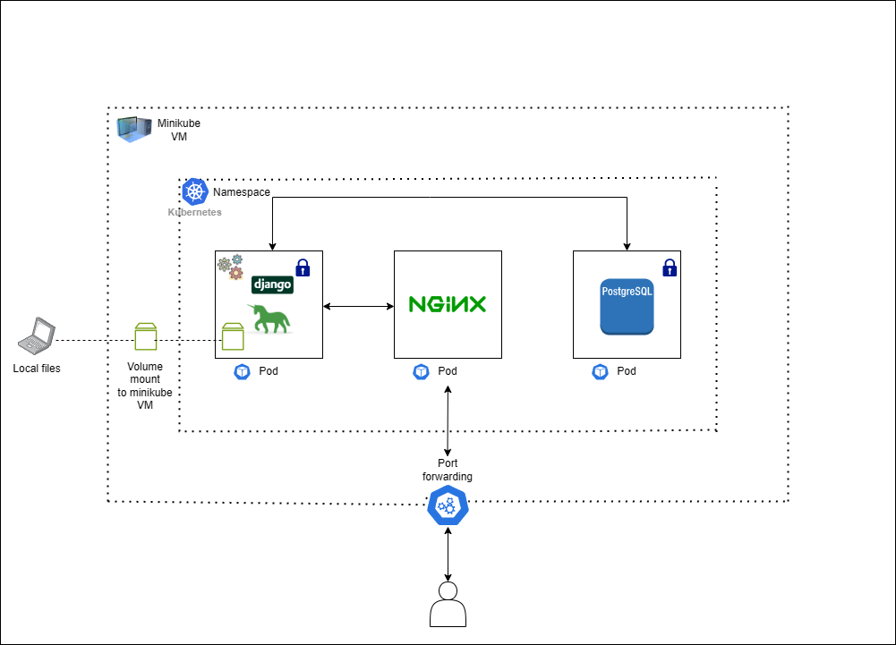

## Django application skeleton deployed to minikube's cluster for local development

This application skeleton serves as the base for a Django application deployed to minikube Kubernetes cluster.

Things to note is that the application architecture includes Django & gunicorn, nginx, and Postgresql.

The local deployment involves 3 pods, each of which contains the following:
nginx,
PostgreSQL,
Django & gunicorn



To get started, clone this repository and run the following commands:

##### Note: This Readme assumes that you have the docker engine running and docker-compose, minikube, and kubectl installed and configured.

### Prerequisites

I am using minikube VM's docker daemon to run local images without having to pull from dockerhub or any other container registries.

These are the steps I followed:

Use minikube docker-env
```sh
eval $(minikube docker-env)
```

Use docker-compose to build your images:
```sh
docker-compose build
```
Run `docker images` to ensure that the images are present.

### Starting minikube-django-architecture 
Ensure minikube is running on the machine.
```sh
minikube status
```
After cloning the repo and ensuring minikube is running, next, we mount the local directory to the minikube VM by running the following command:
```sh
minikube mount "your/path/to/this/repo's/api/src:/opt/code"
```
##### NOTE: This process must stay alive for the mount to be accessible ...

This way, we don't have to keep building our image to test code changes. This allows you to actively work on code on your host machine while having it directly accessible to containers running in the cluster.

Next, we run all the config files using kubectl. This can be done by running the following commands:
```sh
# For db service
kubectl apply -f k8s/db/secrets.yaml
kubectl apply -f k8s/db/deployments.yaml
kubectl apply -f k8s/db/service.yaml

# For nginx service
kubectl apply -f k8s/nginx/deployments.yaml
kubectl apply -f k8s/nginx/service.yaml

# For api service.
kubectl apply -f k8s/api/secrets.yaml
kubectl apply -f k8s/api/configmap.yaml
kubectl apply -f k8s/api/deployments.yaml
kubectl apply -f k8s/api/service.yaml
```
Run `kubectl get service` to ensure that the services are available.

At this point, your Django application should be running. You can get your pods and check their logs by running the following command.
```sh
kubectl get pods
kubectl logs <your_pod_name>
```
Lastly, to access your Django application from the web browser, you need to do port forwarding to Access Applications in a Cluster.
You can do this by running the following command:
```sh
kubectl port-forward service/nginx 3000:80
```
Now your application should be accessible from [http://localhost:3000](http://localhost:3000)

